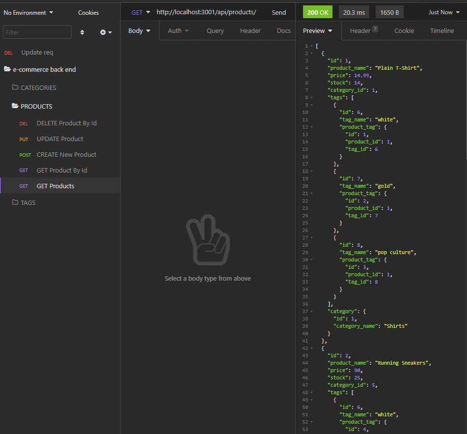
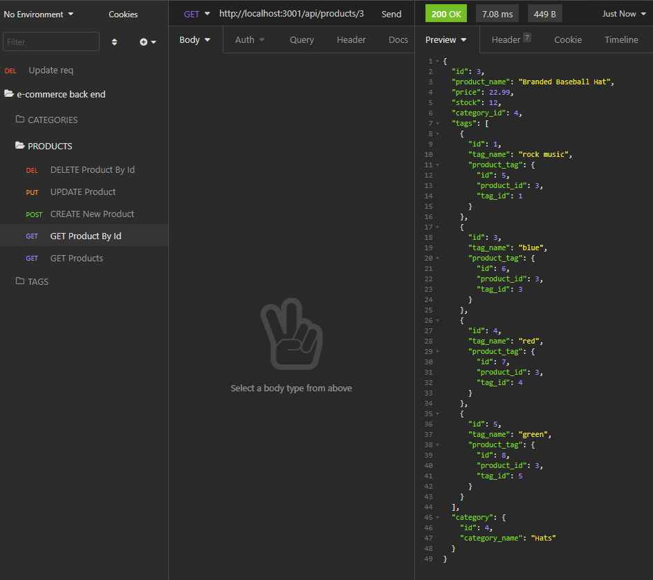
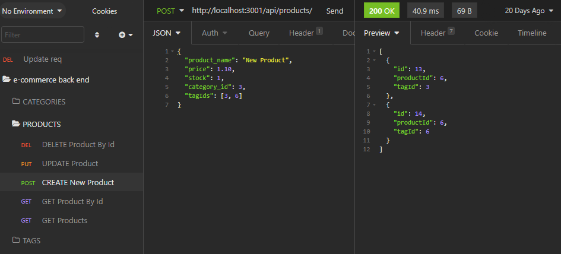
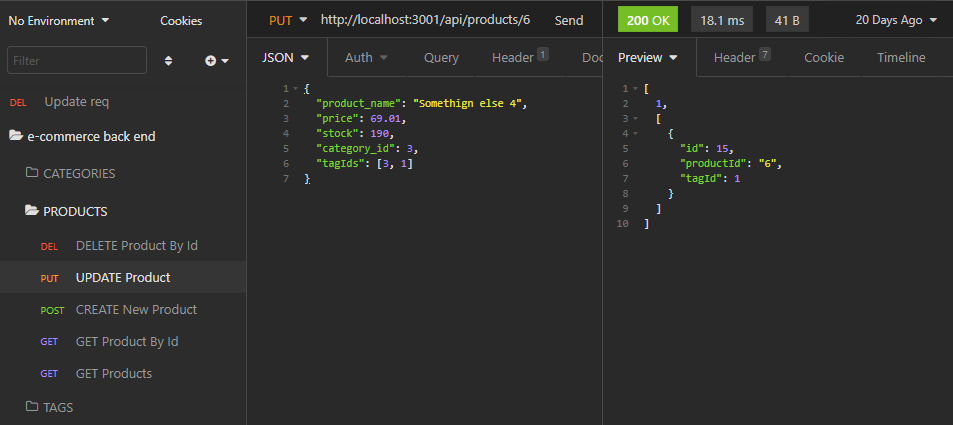
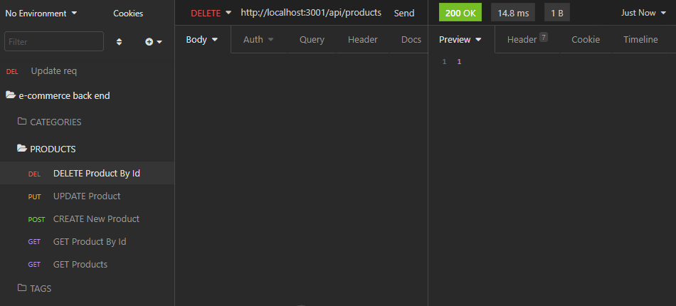

# 13-Object-Relational-Mapping-ORM-E-Commerce-Back-End

## Description

This aplication is a model for a back end e-commerce site.

##  Link to video "demonstrating the entirety of the app's functionality"

https://youtu.be/i-qrzFCKH78

## Usage

- Run ```npm install```

- Seed the db with ```npm run seed```

- start the server with ```npm start```

- connect to insomnia at ```http://localhost:3001```

## Screenshots







## Contact

### Email

Dylan Cole <logboarddjc@gmail.com>

## License

MIT License

Copyright (c) [2021] [Dylan Cole]